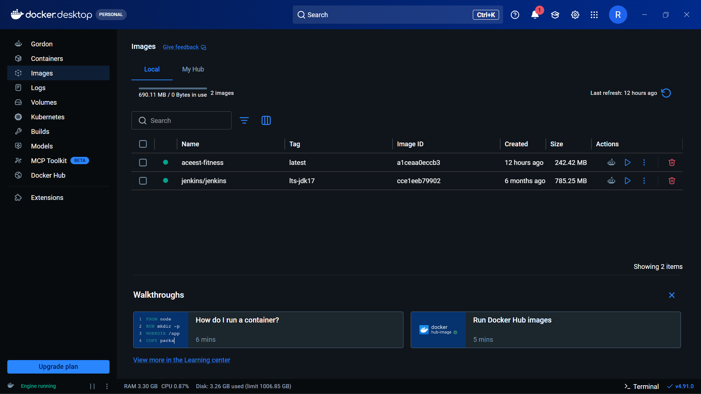
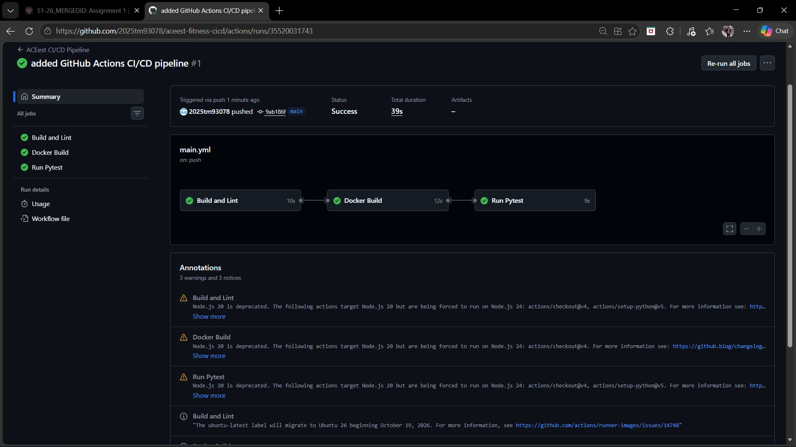
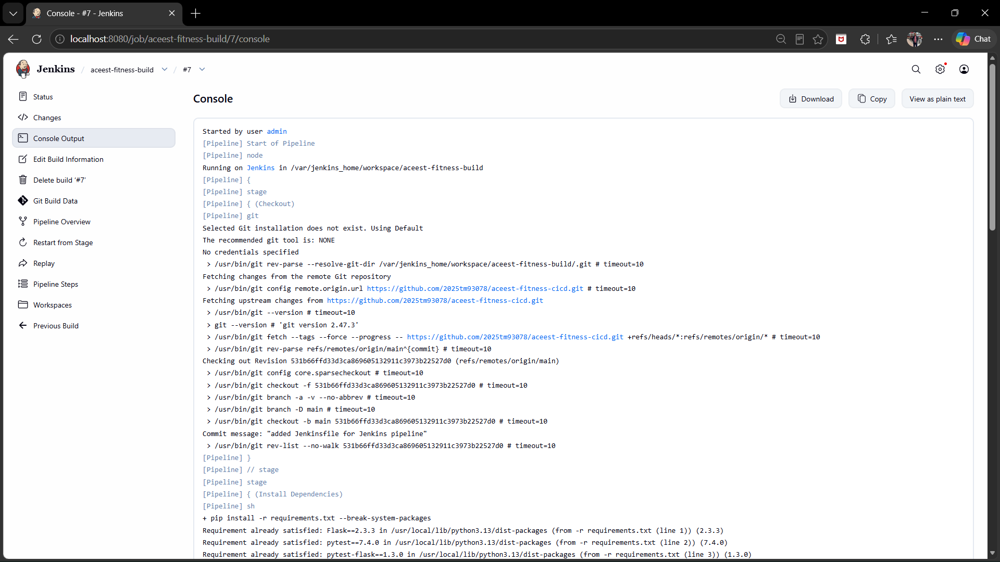
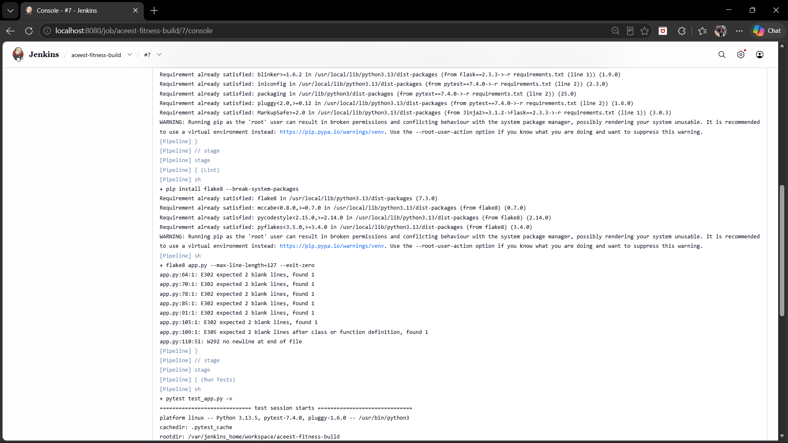
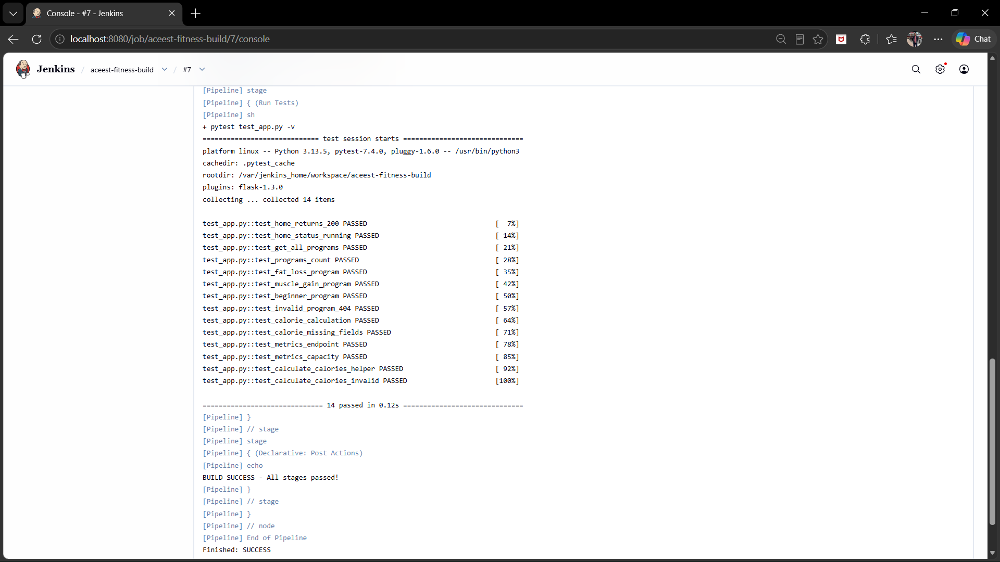

# ACEest Fitness & Gym — CI/CD Pipeline

## Project Overview
A Flask web application for ACEest Fitness & Gym with a fully automated CI/CD pipeline using GitHub Actions and Jenkins.

## Local Setup
```bash
git clone https://github.com/2025tm93078/aceest-fitness-cicd.git
cd aceest-fitness-cicd
pip install -r requirements.txt
python app.py
```
Visit http://localhost:5000

## API Endpoints
- GET / — Health check
- GET /programs — List all fitness programs
- GET /programs/<id> — Get specific program
- POST /calories — Calculate daily calories
- GET /metrics — Gym metrics

## Running Tests Manually
```bash
pytest test_app.py -v
```

## Docker
```bash
docker build -t aceest-fitness .
docker run -p 5000:5000 aceest-fitness
```


## GitHub Actions Pipeline
Triggers on every push to main branch:
1. Build and Lint — checks code with flake8
2. Docker Build — builds the container
3. Run Pytest — runs all 14 tests


## Jenkins Pipeline
Jenkins pulls from GitHub and runs:
1. Checkout — clones the repo
2. Install Dependencies — pip install
3. Lint — flake8 check
4. Run Tests — pytest (14 tests passing)


